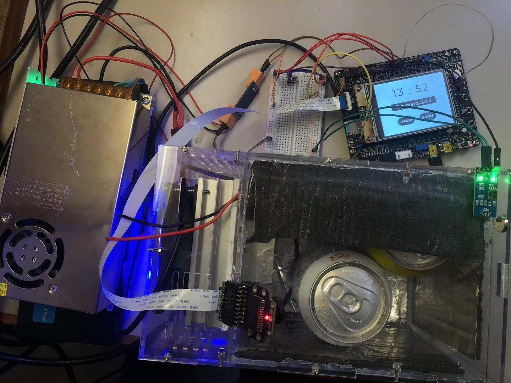
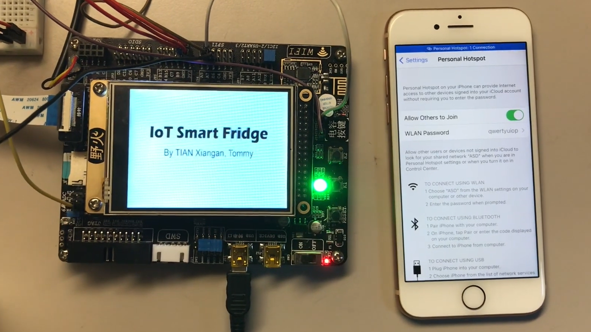

# IoT-Smart-Fridge

## Overall Looking

## WiFi Connection

## Features
- Real-time inner temperature measurement with DS18B20 (1-Wire Communication Protocol).
- PID temperature control with cooling module LBS-12706A (PWM, PID).
- Fridge door unclose detection with Hall-sensor a3144. If the fridge door remains unclosed for more than 30 seconds, the buzzer will ring, and red LED will be switched on (GPIO).
- ESP8266 Wi-Fi connection (UART, AT Commands).
- RTC and SNTP. Real time clock is enabled, and the board can synchronize time with cloud server through Internet (Real Time Clock, Simple Network Time Protocol).
- Internet-of-Things. The board can communicate with cloud server through Internet via TCP protocol. It can send data to the server and receive command from the server (UART, TCP, AT Commands).
- Camera streaming and photo taking. Camera image can be displayed on LCD in real time. Photos can be taken and stored in SD card (SCCB, SDIO).
- Graphical user interface and touch control. It has an easy-to-use GUI with animation and user can control the board with touch screen (FSMC, SPI).
- LCD auto brightness. The brightness of LCD can be adjusted automatically according to ambient light (ADC, PWM).
- Pin-switch-on-the-fly. There are some pins used by both camera ov7725 and ESP8266. The system can configure the correct states for the pin for each component in run time (UART, GPIO).
- System crash detection and auto reboot (IWDG).
- RTOS integration. Multi-task execution, better system resources distribution, dynamic memory allocation but much more complicated software design.
